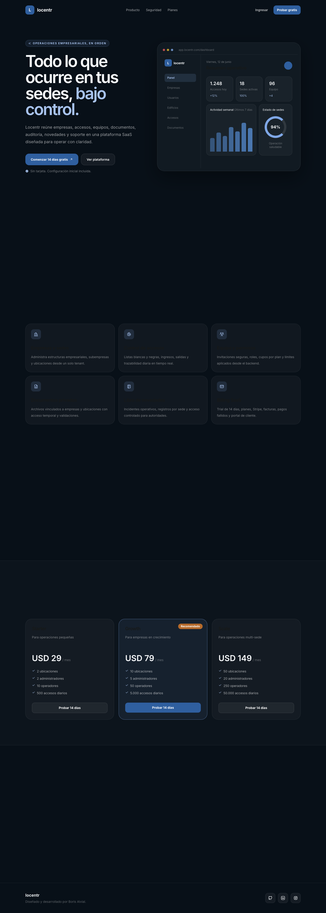
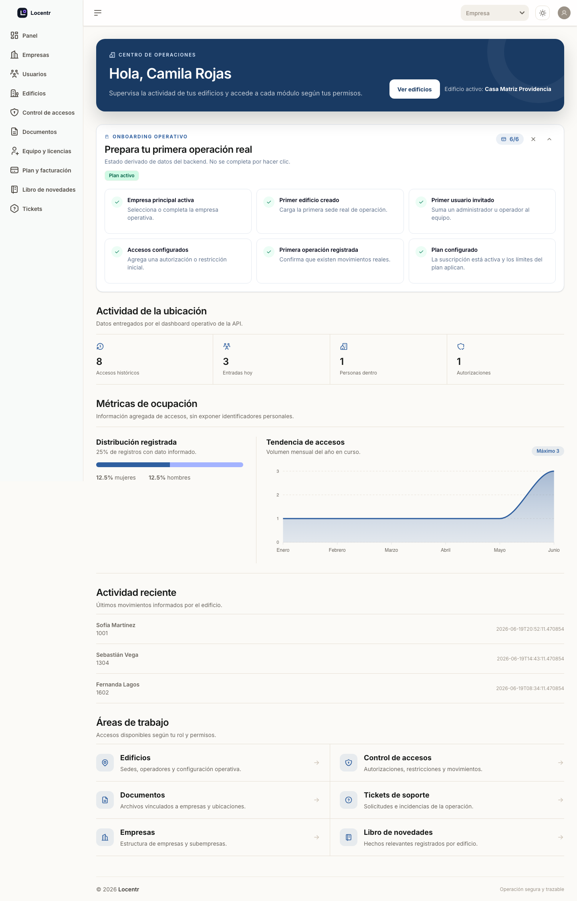

# Locentr Dashboard

Locentr Dashboard is the React frontend for Locentr, a portfolio SaaS for multi-company operations: buildings, access control, documents, teams, billing and operational activity in one place.

## Preview





## What It Includes

- Public landing page with GSAP motion.
- Authenticated dashboard with tenant-aware company and building context.
- Companies, users, buildings, access lists, documents, support tickets and logbook modules.
- Team invitations, license usage and subscription/billing states.
- Route guards, API error handling, coverage gates and Playwright E2E tests.

## Stack

- React 19 + TypeScript
- Vite
- Tailwind CSS
- GSAP + ScrollTrigger
- Zustand + SWR + Axios
- React Hook Form + Zod
- TanStack Table
- Vitest + Playwright

## Local Setup

```bash
npm ci --legacy-peer-deps
npm run dev
```

By default the app expects the API at `http://localhost:8000`. For the local API used by the portfolio seed:

```bash
VITE_API_BASE_URL=http://127.0.0.1:8000 npm run dev
```

Quality checks:

```bash
npm run lint -- --quiet
npm run typecheck
npm run test:coverage
npm run build
npm run test:e2e
```

A reproducible local real-flow E2E is available when Docker is running and the backend repo is present at the expected path:

```bash
npm run test:e2e:real
```

It starts PostgreSQL, runs Alembic, seeds demo data, starts FastAPI and verifies login, navigation, mutation, 403/404 handling, logout and route protection.

## Environment

```bash
VITE_API_BASE_URL=http://127.0.0.1:8000
VITE_API_PROXY_TARGET=http://127.0.0.1:8000
VITE_TELEMETRY_ENDPOINT=
```

`VITE_TELEMETRY_ENDPOINT` is optional. Error telemetry is sanitized and never sends passwords, tokens or authorization headers.

## Deployment Status

The frontend is ready to deploy, but the portfolio deploy is not considered closed until there is a real public frontend URL connected to a real public API URL.

To close the deploy issue, create/link the hosting project, configure production environment variables, deploy both repos, and attach the public URLs plus a passing smoke/E2E result against that environment.

## Related Repository

Backend API: [NoisGit/locentr-api](https://github.com/NoisGit/locentr-api)

## Author

Built by [NoisGit](https://github.com/NoisGit).
